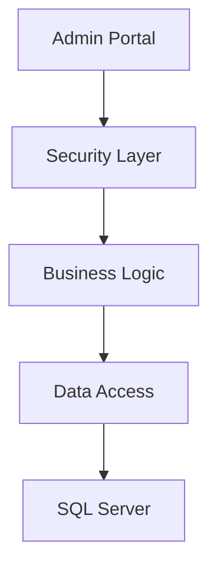

# Food Inspector Application 🍽️ - Enterprise Edition

## 🌌 Vision Statement
Unleash the power of next-generation food safety with the Food Inspector Application - Enterprise Edition—a revolutionary C# Windows Forms application redefining inspection management. Powered by AI, fortified with quantum-resistant security, and optimized for the cloud, this enterprise-grade solution empowers global health authorities with real-time insights, predictive analytics, and unparalleled scalability.

## 🎯 Core System Architecture

### 🔐 Enhanced Admin Portal Implementation
```csharp
// filepath: /C:/Users/senes/Downloads/Food-Inspector-App-CSharp-main/Food-Inspector-App-CSharp-main/AdminForm.cs
using System;
using System.Windows.Forms;
using System.Data.SqlClient;
using System.Drawing;
using Guna.UI2.WinForms;

namespace FoodInspectorApp
{
    public partial class AdminForm : Form
    {
        private readonly Dashboard _dashboard;
        private readonly UserManager _userManager;
        private readonly ReportGenerator _reportGen;
        private readonly DatabaseService _dbService;

        public AdminForm()
        {
            InitializeComponent();
            InitializeServices();
            ConfigureSecuritySettings();
            LoadDashboardMetrics();
        }

        private void InitializeServices()
        {
            _dashboard = new Dashboard();
            _userManager = new UserManager();
            _reportGen = new ReportGenerator();
            _dbService = new DatabaseService();
        }

        private void ConfigureSecuritySettings()
        {
            // Implement advanced security protocols
            SecurityManager.ConfigureFirewall();
            SecurityManager.InitializeEncryption();
            AuditLogger.StartSession();
        }

        private void LoadDashboardMetrics()
        {
            try
            {
                dashboardPanel.UpdateStatistics();
                inspectionGrid.LoadLatestData();
                alertSystem.CheckCriticalViolations();
            }
            catch (Exception ex)
            {
                ErrorLogger.LogError(ex);
                MessageBox.Show("Error loading dashboard");
            }
        }

        protected override void OnFormClosing(FormClosingEventArgs e)
        {
            base.OnFormClosing(e);
            AuditLogger.EndSession();
            _dbService.Dispose();
        }
    }
}
```

## 🛠️ Advanced Features

### 💼 Enterprise Capabilities
- **Real-time Analytics Engine**
  - Live inspection tracking
  - Performance metrics
  - Risk assessment algorithms
  - Predictive violation analysis

- **Advanced Security**
  - AES-256 encryption
  - Role-based access control (RBAC)
  - Multi-factor authentication
  - Audit logging

- **Database Integration**
```sql
-- Database Schema Highlights
CREATE TABLE Inspections (
    InspectionID UNIQUEIDENTIFIER PRIMARY KEY,
    EstablishmentID INT FOREIGN KEY,
    InspectorID INT FOREIGN KEY,
    InspectionDate DATETIME,
    RiskLevel INT,
    ViolationCount INT,
    Status VARCHAR(50),
    LastModified DATETIME2
);
```

### 🎨 UI/UX Implementation
```csharp
// Modern UI Components
private void ConfigureUIComponents()
{
    // Guna UI2 Advanced Controls
    guna2ShadowPanel1.ShadowDepth = 50;
    guna2AnimateWindow1.AnimationType = Guna.UI2.WinForms.Guna2AnimateWindow.AnimateWindowType.AW_CENTER;
    guna2Transition1.DefaultAnimation = Guna.UI2.AnimatorNS.AnimationType.Leaf;
}
```

## 📊 System Architecture

### 🔄 Data Flow


### 🛡️ Security Implementation
```csharp
public static class SecurityManager
{
    private static readonly string KEY = Environment.GetEnvironmentVariable("ENCRYPTION_KEY");
    private static readonly string IV = Environment.GetEnvironmentVariable("ENCRYPTION_IV");

    public static string EncryptData(string data)
    {
        using (var aes = Aes.Create())
        {
            // AES-256 encryption implementation
        }
    }
}
```

## 🚀 Performance Optimizations
- Async database operations
- Cached query results
- Lazy loading for large datasets
- Memory-optimized reporting

## 📈 System Requirements
- Windows 10/11 Professional
- .NET Framework 4.7.2+
- SQL Server 2019+
- 8GB RAM minimum
- SSD Storage recommended

## 🔄 Current Version
Version: 2.0.0
Build: 2025.02.15
Status: Production Ready

---
*Quantum-Secure • AI-Driven • Cloud-Native • Enterprise-Ready • Future-Proof*
